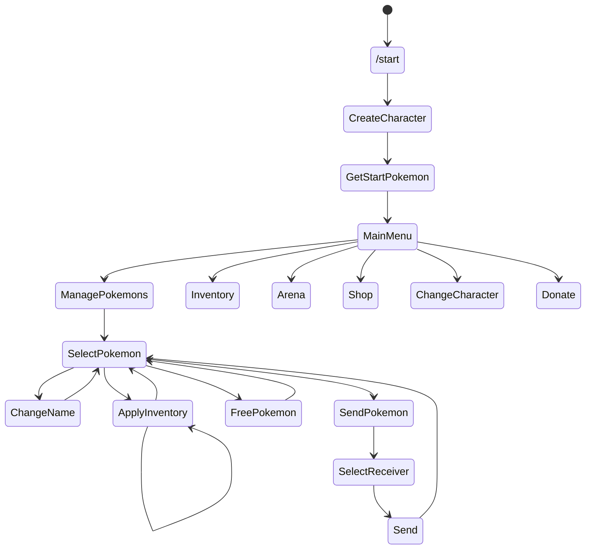

# Андреев Николай Владимирович

Тема проекта: Pokégochi

Основная функциональность:

- Кастомизация персонажа
- Работа с покемонами:
  - Рандомный стартовый покемон
  - Покупка покемонов за внутриигровую валюту
  - Система уровней и прокачка характеристик
- Инвентарь:
  - Лекарства
  - Бусты
  - Движения
- Битвы покемонов:
  - Выбор покемона для битвы
  - Расчёт результата битвы
  - Рейтинг
- Достижения
- Магазин
- Донат (BTC, ETH, USDC, TON)

ToDo:

- Кланы
- Боевой пропуск
