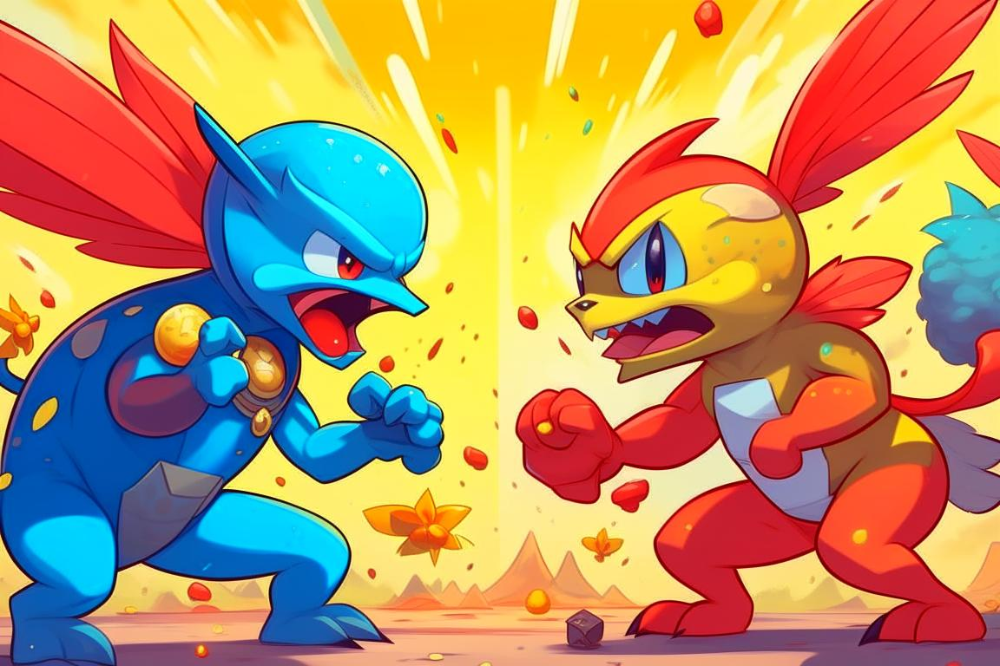
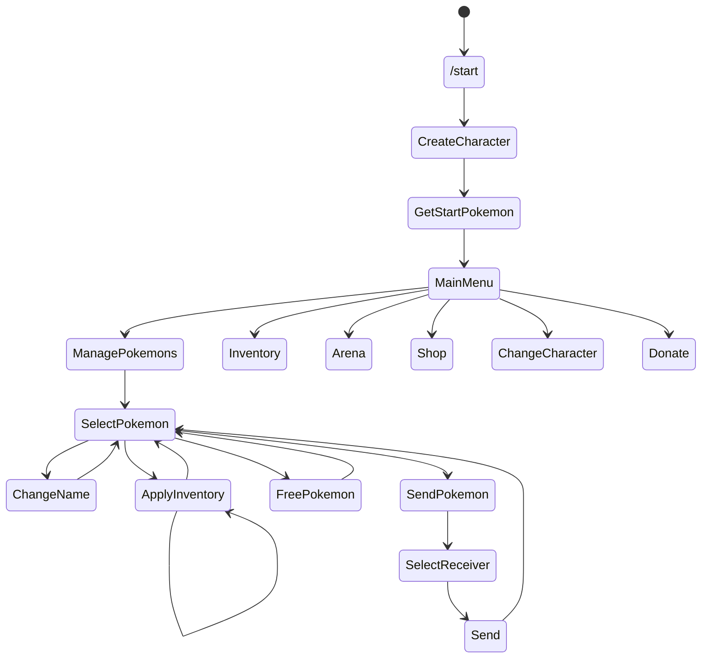

# Pokégochi

Многопользовательская игра с возможностью сражений между покемонами различных игроков и их прокачкой.

**Автор проекта:** Андреев Николай Владимирович

[Запустить бота](https://t.me/PokegochiBot)

  
Диаграмма состояний

## Основные команды

|  Команда   | Описание                                                     |
|:----------:|--------------------------------------------------------------|
|  `/start`  | Начало работы с ботом, список основных команд                |
|  `/help`   | Открыть справку по игре и полный список команд с пояснениями |
| `/battle`  | Начать битву (выбор покемона и предметов)                    |
|  `/shop`   | Открыть магазин                                              |
|  `/stats`  | Посмотреть статистику персонажа                              |
| `/pokemon` | Выбрать покемона (просмотр статистики, выбор инвентаря)      |
| `/pocket`  | Открыть инвентарь                                            |

## Что умеет бот

- [ ] Кастомизация персонажа
- [ ] Работа с покемонами:
  - [ ] Рандомный стартовый покемон
  - [ ] Покупка покемонов за внутриигровую валюту
  - [ ] Система уровней и прокачка характеристик
- [ ] Инвентарь:
  - [ ] Лекарства
  - [ ] Бусты
  - [ ] Движения
- [ ] Битвы покемонов:
  - [ ] Выбор покемона для битвы
  - [ ] Расчёт результата битвы
  - [ ] Рейтинг
- [ ] Достижения
- [ ] Магазин
- [ ] Донат (BTC, ETH, USDC, TON)

## Панель управления

Панель управления работает через веб-интерфейс и позволяет выдавать покемонов и различные предметы игрокам, проверять результаты битв и блокировать нечестных игроков.

[Ссылка на панель управления](https://www.youtube.com/watch?v=dQw4w9WgXcQ)
